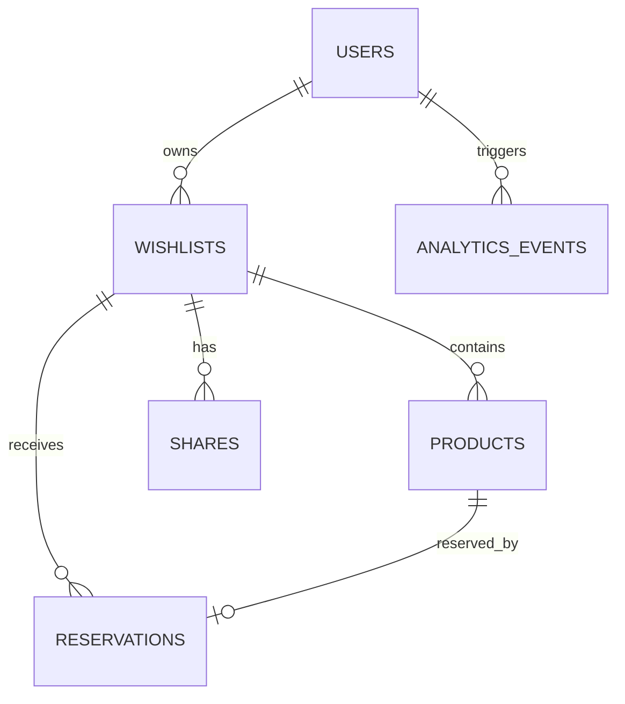

# Online WishList PRD

## 1. Executive Summary

Online WishList is a universal wishlist platform that lets users save products from any online store, organize them into wishlists, and share those wishlists with friends and family. The product solves a common gifting problem: people know what they want, but the information is scattered across screenshots, browser tabs, notes, chat messages, and forgotten links.

The core product promise is simple: save any product from any shop, share one clean wishlist, and let gift-givers reserve items so the recipient gets gifts they actually want.

The initial product should validate whether users want a universal wishlist that is independent of a single marketplace. The MVP should focus on fast onboarding, reliable product capture, public sharing, and gift reservation.

## 2. Vision & Strategy

### Product Vision

Online WishList becomes the default place where people collect, organize, and share things they want to receive as gifts, regardless of where those items are sold.

### Strategic Thesis

Most wishlist tools are tied to specific marketplaces, registries, or stores. Real users shop across many websites, social feeds, niche boutiques, local brands, international marketplaces, and independent ecommerce stores. A universal wishlist that works across the open web can become a durable consumer utility.

### Competitive Advantage

The main competitive advantage is store independence. Users should not need to care whether an item comes from Amazon, Etsy, Zara, Apple, a local Shopify store, Instagram shop, or a small boutique site.

### Product Principles

- Universal first: the product must work with any online store.
- Fast capture: adding a product should take seconds.
- Shareable by default: wishlists should be easy to send and easy to open.
- Low friction for friends: gift-givers should not need an account to reserve a gift.
- Privacy aware: users must understand what is public, private, and shared.
- MVP discipline: avoid advanced automation until the core loop is validated.

## 3. Problem Statement

Users currently save desired products in fragmented, unreliable ways:

- Screenshots without product URLs.
- Dozens of open browser tabs.
- Notes apps with incomplete context.
- Links sent to themselves in messengers.
- Product URLs lost in chat history.
- Marketplace-specific wishlists that do not cover the whole web.
- Gift ideas that friends and family never see.
- Duplicate gifts or unwanted gifts because there is no reservation flow.

The market lacks a simple, universal, consumer-friendly wishlist that works across any online store and helps gift-givers coordinate.

## 4. Goals

### Business Goals

- Validate product-market fit for a universal wishlist product.
- Acquire the first 1,000 registered users.
- Validate whether shared wishlists create viral acquisition.
- Measure demand for saving products from arbitrary online stores.
- Identify the strongest acquisition channels.
- Learn which persona and use case has the highest retention.

### Product Goals

Users must be able to:

- Create a wishlist.
- Add a product to a wishlist.
- Save a product from any online store.
- Share a wishlist publicly or privately.
- Let friends reserve gifts.
- See which items are reserved without spoiling the surprise when appropriate.
- Manage wishlists and products from a personal dashboard.

### MVP Learning Goals

- Do users add products from more than one store?
- Do users share wishlists after creating them?
- Do recipients invite enough gift-givers to drive organic growth?
- Do gift-givers understand reservation without support?
- Which import path is most reliable: URL, extension, manual entry, or fallback extraction?

## 5. Success Metrics

| Category | KPI | Target for MVP | Why It Matters |
| --- | --- | --- | --- |
| Acquisition | Registered users | 1,000 users | Validates initial demand |
| Activation | Wishlist created after signup | 60%+ | Shows onboarding clarity |
| Activation | First product added | 50%+ | Confirms product capture works |
| Engagement | Products per active user | 5+ | Indicates real collecting behavior |
| Sharing | Wishlists shared | 35%+ of created wishlists | Tests viral loop |
| Virality | New visitors per shared wishlist | 3+ | Measures distribution potential |
| Conversion | Gift-giver reservation rate | 15%+ of public wishlist visitors | Tests utility for friends |
| Retention | 30-day returning users | 25%+ | Measures durable use |
| Import Quality | Successful URL imports | 70%+ | Validates universal promise |
| Support | Failed import recovery | 80%+ recoverable manually | Prevents dead ends |

## 6. Target Audience

### Primary Persona: Gift Organizer

- Woman, 25-45 years old.
- Shops online regularly.
- Uses Instagram, TikTok, Pinterest, marketplaces, and brand stores for discovery.
- Often receives gifts from partner, family, friends, or colleagues.
- Wants people to know what she likes without awkwardly asking.
- May organize birthday, holiday, wedding, baby shower, housewarming, or personal wishlists.

### Pain Points

- Saves items in too many places.
- Forgets where a product was found.
- Receives gifts that do not match taste, size, brand, or preference.
- Feels uncomfortable sending individual links repeatedly.
- Existing wishlists are limited to one marketplace.
- Friends ask what to buy at the last minute.

### Goals

- Keep all desired products in one place.
- Share one polished link.
- Avoid duplicate gifts.
- Make gift-giving easier for loved ones.
- Preserve personal taste and product details.
- Add products quickly from mobile and desktop.

### Secondary Personas

Gift-giver:

- Friend, partner, family member, or colleague.
- Wants to buy the right gift quickly.
- Does not want to create an account.
- Needs product details, price, link, and reservation clarity.

Event planner:

- Organizes birthdays, weddings, baby showers, holidays, office events, or group gifts.
- Needs a clean list to share with many people.
- Wants to reduce coordination overhead.

Power shopper:

- Collects products across many categories.
- Wants organization, folders, notes, and future price tracking.

## 7. Jobs To Be Done

- When I find something I want online, I want to save it immediately, so I can return to it later.
- When my birthday or holiday is coming, I want to share a curated wishlist, so people know what to buy.
- When someone asks what I want, I want to send one link, so I do not have to explain everything manually.
- When I am buying for someone else, I want to see available gifts and reserve one, so I do not duplicate another person.
- When a product import fails, I want a manual fallback, so I do not lose the item.
- When I share a wishlist, I want control over privacy, so I can decide who sees it.

## 8. Scope

### Included in MVP

- Google authentication.
- User dashboard.
- Wishlist creation and editing.
- Product import by URL.
- Manual product creation.
- Browser extension concept and initial technical contract.
- AI-assisted fallback extraction as an optional backend path.
- Public wishlist page.
- Gift reservation flow.
- Wishlist sharing link.
- Basic analytics events.
- Responsive web UI.
- Basic SEO for public wishlist pages.
- Security and privacy foundations.

### Out of Scope for MVP

- AI recommendations.
- Price tracking.
- Native mobile apps.
- Affiliate monetization.
- Full AI assistant.
- Marketplace checkout integration.
- Group payments.
- In-app messaging.
- Advanced social features.
- Complex notification system.
- Multi-language localization beyond product-ready copy structure.

## 9. User Experience Overview

### Core Flow

Registration -> Dashboard -> Create Wishlist -> Import Product -> Share Wishlist -> Friend Opens Wishlist -> Friend Reserves Gift

### UX Principles

- First useful action should happen within one minute.
- Product import must never end in a dead end.
- Public wishlist pages should be beautiful, fast, and obvious.
- Gift reservation should be possible without signup.
- Privacy state must be visible before sharing.
- The user should always understand whether a wishlist is private, unlisted, or public.

## 10. Information Architecture

Primary app areas:

- Landing page.
- Authentication.
- Dashboard.
- Wishlist detail.
- Add product.
- Product edit.
- Settings.
- Public wishlist.
- Reservation confirmation.

Dashboard hierarchy:

- User account.
- Wishlists.
- Products inside wishlists.
- Shares and public links.
- Reservations.

## 11. Functional Requirements

### Epic 1: Authentication

User story:

As a user, I want to sign in with Google, so I can start quickly.

Acceptance criteria:

- User can sign in with Google OAuth.
- User profile is created after first successful sign-in.
- Returning users are routed to the dashboard.
- Signed-out users can view public wishlists.
- Authentication errors show friendly recovery states.
- User can sign out.

Edge cases:

- OAuth popup blocked.
- User cancels Google sign-in.
- Email already exists through another auth provider in the future.
- Session expires while editing a wishlist.

### Epic 2: Create Wishlist

User story:

As a user, I want to create a wishlist, so I can organize products for an occasion or theme.

Acceptance criteria:

- User can create a wishlist with title, description, visibility, and optional occasion.
- Wishlist title is required.
- User can edit wishlist metadata.
- User can delete or archive a wishlist.
- User can set visibility to private or shareable.
- Empty wishlist has a clear add-product state.

Edge cases:

- Duplicate wishlist names are allowed but visually distinguishable.
- Deleted wishlists should not be accessible publicly.
- Private wishlists should not be visible through public links.

### Epic 3: Import Products

User story:

As a user, I want to add products from any online store, so my wishlist is not limited to one marketplace.

#### Scenario A: URL Import

Acceptance criteria:

- User can paste a product URL.
- System attempts to extract title, image, price, currency, store name, and description.
- User can review and edit extracted details before saving.
- Product URL is stored as canonical source link.
- If extraction fails, user is guided to manual entry.

Edge cases:

- Page blocks scraping.
- Product page requires JavaScript rendering.
- Product is out of stock.
- Multiple images are available.
- Price is missing or varies by variant.
- Currency is ambiguous.
- URL redirects.
- URL is invalid.

#### Scenario B: Browser Extension

Acceptance criteria:

- Extension can send current page URL to the web app.
- If user is signed in, extension opens product save flow.
- If user is signed out, extension prompts authentication.
- Extension payload uses the same import API contract as URL import.

MVP note:

The first MVP may define and document the extension contract before fully shipping the extension.

#### Scenario C: Manual Entry

Acceptance criteria:

- User can manually add product title, URL, image URL, price, store, notes, size, color, and priority.
- Only title is required.
- Manual products can be edited later.
- Manual entry is available after failed URL import.

#### Scenario D: AI Fallback

Acceptance criteria:

- If deterministic extraction fails, backend may attempt AI-assisted extraction from available metadata or page text.
- User must still review extracted data.
- AI extraction cannot save a product without user confirmation.
- Failures fall back to manual entry.

### Epic 4: Public Wishlist

User story:

As a user, I want to share a public wishlist page, so friends can see what gifts I want.

Acceptance criteria:

- Public wishlist is accessible by share URL.
- Page displays wishlist title, description, owner display name, and products.
- Product cards show image, title, store, price, notes, and source link.
- Reserved products are visually marked according to privacy rules.
- Page is responsive and fast.
- Public page has SEO-safe metadata where appropriate.

Edge cases:

- Wishlist has no products.
- Product image fails to load.
- Wishlist has been made private after sharing.
- Wishlist has been deleted.

### Epic 5: Gift Reservation

User story:

As a gift-giver, I want to reserve a gift, so others know it is already taken.

Acceptance criteria:

- Gift-giver can reserve an available product from a public wishlist.
- Gift-giver can enter name and optional email.
- Gift-giver does not need an account.
- Reserved state is saved immediately.
- Product cannot be reserved twice.
- Reservation can optionally include a note.
- Reservation confirmation is shown.

Privacy criteria:

- Wishlist owner can see reservation status.
- Public visitors can see whether an item is reserved.
- Gift-giver personal details are not publicly displayed.

Edge cases:

- Two users reserve the same item at the same time.
- Gift-giver closes page during reservation.
- Gift-giver wants to cancel reservation.
- Owner wants to manually clear a reservation.

### Epic 6: Sharing

User story:

As a user, I want to share my wishlist with one link, so friends and family can open it easily.

Acceptance criteria:

- User can copy share link.
- User can regenerate share token.
- User can disable public sharing.
- Share link opens public wishlist.
- Sharing event is tracked.

Future sharing channels:

- WhatsApp.
- Telegram.
- Instagram bio.
- Email.
- QR code.

### Epic 7: Analytics

User story:

As the product team, I want analytics events, so we can validate product-market fit and improve onboarding.

Acceptance criteria:

- Signup event is tracked.
- Wishlist created event is tracked.
- Product added event is tracked with import method.
- Wishlist shared event is tracked.
- Public wishlist opened event is tracked.
- Gift reserved event is tracked.
- Return visit event is tracked.
- Failed import event is tracked.

Analytics must not expose private gift-giver details in event properties.

## 12. User Stories

1. As a visitor, I want to understand the value of Online WishList quickly, so I can decide whether to sign up.
2. As a user, I want to sign in with Google, so I can start without creating another password.
3. As a user, I want to create a wishlist, so I can organize products around a birthday, holiday, or personal goal.
4. As a user, I want to name my wishlist, so friends understand the context.
5. As a user, I want to add a description, so I can explain preferences and occasion details.
6. As a user, I want to paste a product URL, so I can save an item from any online store.
7. As a user, I want product details to be extracted automatically, so I do not need to type everything.
8. As a user, I want to edit imported product details, so I can correct missing or wrong information.
9. As a user, I want to add a product manually, so I can save items even when import fails.
10. As a user, I want to include size, color, and notes, so gift-givers buy the correct variant.
11. As a user, I want to add a product image, so the wishlist looks clear and attractive.
12. As a user, I want to organize products in a wishlist, so the list is easy to browse.
13. As a user, I want to share a wishlist link, so I can send it to friends and family.
14. As a user, I want to disable a share link, so I can stop access when needed.
15. As a user, I want to make a wishlist private, so only I can see it.
16. As a friend, I want to open a wishlist without creating an account, so I can choose a gift quickly.
17. As a friend, I want to view product price and store, so I can decide what to buy.
18. As a friend, I want to open the original product page, so I can purchase from the store.
19. As a friend, I want to reserve a gift, so others do not buy the same item.
20. As a friend, I want reservation to be simple, so I can complete it quickly.
21. As a user, I want to see reservation status, so I know which gifts are taken.
22. As a user, I want gift-giver identity protected publicly, so sharing remains comfortable.
23. As a product team, I want to know which import methods users choose, so we can prioritize reliability.
24. As a product team, I want to know how often users share wishlists, so we can measure virality.
25. As a product team, I want to know where imports fail, so we can improve the universal saving promise.

## 13. Database Model

### Entities

Users:

- id.
- email.
- display_name.
- avatar_url.
- auth_provider.
- created_at.
- updated_at.

Wishlists:

- id.
- user_id.
- title.
- description.
- visibility.
- occasion.
- share_token.
- share_enabled.
- created_at.
- updated_at.
- archived_at.

Products:

- id.
- wishlist_id.
- title.
- source_url.
- image_url.
- price_amount.
- price_currency.
- store_name.
- description.
- notes.
- size.
- color.
- priority.
- import_method.
- import_status.
- created_at.
- updated_at.

Reservations:

- id.
- product_id.
- wishlist_id.
- reserver_name.
- reserver_email.
- note.
- status.
- created_at.
- cancelled_at.

Shares:

- id.
- wishlist_id.
- share_token.
- channel.
- created_at.
- disabled_at.

Analytics Events:

- id.
- user_id.
- anonymous_id.
- event_name.
- properties.
- created_at.

### ER Diagram



## 14. API Requirements

### Authentication

Authentication is handled by Supabase Auth with Google OAuth.

### Wishlist APIs

`POST /api/wishlists`

Creates a wishlist.

Request:

```json
{
  "title": "Birthday Wishlist",
  "description": "Things I would love this year",
  "visibility": "private",
  "occasion": "birthday"
}
```

Response:

```json
{
  "id": "wishlist_id",
  "title": "Birthday Wishlist",
  "shareEnabled": false
}
```

`GET /api/wishlists`

Returns wishlists for the authenticated user.

`GET /api/wishlists/:id`

Returns one wishlist for the authenticated owner.

`PATCH /api/wishlists/:id`

Updates wishlist metadata.

`DELETE /api/wishlists/:id`

Archives or deletes a wishlist according to product policy.

### Product APIs

`POST /api/products/import`

Imports product data from URL.

Request:

```json
{
  "wishlistId": "wishlist_id",
  "url": "https://store.example/product"
}
```

Response:

```json
{
  "status": "needs_review",
  "draft": {
    "title": "Product title",
    "sourceUrl": "https://store.example/product",
    "imageUrl": "https://store.example/image.jpg",
    "priceAmount": 49.99,
    "priceCurrency": "USD",
    "storeName": "Store Example"
  }
}
```

`POST /api/products`

Creates a product after user review or manual entry.

`GET /api/products/:id`

Returns product details for owner.

`PATCH /api/products/:id`

Updates product details.

`DELETE /api/products/:id`

Removes product from wishlist.

### Sharing APIs

`POST /api/wishlists/:id/share`

Enables sharing and returns a public URL.

`DELETE /api/wishlists/:id/share`

Disables public sharing.

`GET /api/public/wishlists/:shareToken`

Returns public wishlist data.

### Reservation APIs

`POST /api/public/wishlists/:shareToken/products/:productId/reserve`

Creates a reservation.

Request:

```json
{
  "reserverName": "Anna",
  "reserverEmail": "anna@example.com",
  "note": "I will buy this one."
}
```

Response:

```json
{
  "reservationId": "reservation_id",
  "status": "reserved"
}
```

`DELETE /api/reservations/:id`

Cancels a reservation when allowed by policy.

## 15. Permission Matrix

| Capability | Signed-out Visitor | Gift-giver | Wishlist Owner | Admin |
| --- | --- | --- | --- | --- |
| View landing page | Yes | Yes | Yes | Yes |
| Create wishlist | No | No | Yes | Yes |
| Edit own wishlist | No | No | Yes | Yes |
| View private wishlist | No | No | Yes | Yes |
| View shared wishlist | Yes, with link | Yes, with link | Yes | Yes |
| Reserve gift | Yes, with link | Yes, with link | No, unless testing mode exists | Yes |
| See reserver email | No | No | Yes | Yes |
| Disable share link | No | No | Yes | Yes |
| Delete product | No | No | Yes | Yes |

## 16. UI Requirements

### Landing Page

Purpose:

- Explain universal wishlist value.
- Show product capture from any store.
- Encourage Google sign-in.

Required sections:

- Hero with clear product promise.
- How it works.
- Use cases.
- Example wishlist preview.
- Call to action.

### Dashboard

Purpose:

- Show user wishlists.
- Create new wishlist.
- Continue editing existing wishlists.

Required states:

- Empty state.
- Loading state.
- Error state.
- Wishlist cards.

### Wishlist Detail

Purpose:

- Manage wishlist metadata and products.
- Add products.
- Share wishlist.

Required controls:

- Edit title and description.
- Add product.
- Copy share link.
- Enable or disable sharing.
- Product list.
- Reservation status.

### Add Product

Purpose:

- Save products through URL import or manual entry.

Required states:

- URL input.
- Import loading.
- Import review.
- Import failed.
- Manual form.

### Public Wishlist

Purpose:

- Let gift-givers view and reserve gifts.

Required elements:

- Wishlist header.
- Product cards.
- Reserve button.
- Reserved state.
- Product source link.
- Reservation modal.
- Confirmation state.

### Settings

Purpose:

- Manage profile and account basics.

MVP settings:

- Display name.
- Avatar from Google.
- Sign out.

## 17. Non-Functional Requirements

### Performance

- Public wishlist pages should load quickly on mobile.
- Dashboard interactions should feel instant for common operations.
- Product import should show progress if extraction takes more than one second.

### Security

- Enforce row-level security in Supabase.
- Users can only modify their own wishlists and products.
- Public wishlist API must expose only share-safe fields.
- Reservation endpoint must prevent duplicate reservations.
- Validate all URLs and user inputs.
- Rate limit import and reservation endpoints.

### Scalability

- Product import should be async-compatible.
- Analytics should not block user flows.
- Image handling should avoid storing copyrighted images unless policy allows it; store source image URLs initially.

### SEO

- Public wishlists should include metadata when sharing is enabled.
- Private wishlists must not be indexed.
- Landing page should target universal wishlist, online wishlist, gift wishlist, and birthday wishlist search intent.

### Accessibility

- Keyboard navigable forms and modals.
- Proper labels for inputs.
- Sufficient contrast.
- Clear focus states.
- Semantic buttons and links.

### Responsive

- Landing, dashboard, wishlist, and public pages must work on mobile, tablet, and desktop.

### PWA

- MVP should be installable later; initial architecture should not block PWA support.

## 18. Technical Stack

- Next.js for web application.
- Supabase for authentication, Postgres database, and row-level security.
- Tailwind CSS for UI styling.
- Vercel for deployment.
- Cloudflare for DNS, caching, and edge protection where appropriate.
- Chrome Extension for browser-based saving.

## 19. Technical Architecture

### Proposed Modules

- Auth module: session management and protected routes.
- Wishlist module: create, update, list, share, and delete.
- Product module: manual product CRUD and URL import review.
- Import module: metadata extraction, fallback extraction, and import status.
- Public module: share-token lookup and public-safe DTOs.
- Reservation module: reservation creation, cancellation, and conflict protection.
- Analytics module: event capture and property validation.

### Integration Points

- Supabase Auth for Google sign-in.
- Supabase Postgres for persistence.
- Server-side product metadata extraction.
- Optional AI extraction service as fallback.
- Browser extension message/API contract.

### Testing Seams

Highest-value seams:

- Public wishlist API behavior.
- Product import service contract.
- Reservation conflict handling.
- Row-level security policies.
- Dashboard-to-wishlist user flow.
- Public wishlist-to-reservation user flow.

These seams should be validated through integration and end-to-end tests rather than only unit tests.

## 20. Analytics Specification

| Event | Trigger | Key Properties |
| --- | --- | --- |
| `signup_completed` | User completes Google signup | provider |
| `wishlist_created` | Wishlist is created | wishlist_id, occasion, visibility |
| `product_import_started` | URL import begins | wishlist_id, domain |
| `product_import_succeeded` | Import returns usable draft | wishlist_id, domain, method |
| `product_import_failed` | Import cannot extract data | wishlist_id, domain, reason |
| `product_added` | Product is saved | wishlist_id, import_method, has_price, has_image |
| `wishlist_shared` | Share link copied or enabled | wishlist_id, channel |
| `public_wishlist_opened` | Shared wishlist is opened | wishlist_id, anonymous_id |
| `gift_reserved` | Gift-giver reserves product | wishlist_id, product_id |
| `return_visit` | User returns after first session | user_id |

Privacy rule:

Analytics properties must not include gift-giver names, emails, private notes, or raw personal messages.

## 21. Error States

- Authentication failed.
- Session expired.
- Wishlist not found.
- Wishlist is private.
- Share link disabled.
- Product import failed.
- Product URL invalid.
- Product already reserved.
- Reservation failed.
- Network unavailable.
- Database unavailable.
- Rate limit exceeded.

Each error state should include:

- Human-readable message.
- Next best action.
- Retry path where appropriate.

## 22. QA Checklist

Authentication:

- Google signup works.
- Returning user lands on dashboard.
- Sign out works.

Wishlist:

- User can create wishlist.
- User can edit wishlist.
- User can delete or archive wishlist.
- Empty state renders correctly.

Products:

- URL import succeeds for common stores.
- Failed URL import falls back to manual entry.
- Manual product creation works.
- Product edit and delete work.

Sharing:

- Share link opens public wishlist.
- Disabled share link stops access.
- Private wishlist cannot be opened publicly.

Reservations:

- Gift-giver can reserve a product without account.
- Duplicate reservation is blocked.
- Owner can see reservation status.
- Public visitors cannot see reserver private details.

Responsive:

- Landing works on mobile.
- Dashboard works on mobile.
- Public wishlist works on mobile.

Security:

- User cannot access another user's private wishlist.
- User cannot edit another user's products.
- Public API returns only allowed fields.

## 23. Launch Checklist

- Production Supabase project configured.
- Google OAuth configured for production domain.
- Database migrations applied.
- Row-level security policies verified.
- Environment variables configured in Vercel.
- Landing page copy reviewed.
- Analytics events verified.
- Error tracking enabled.
- Public wishlist links tested.
- Import reliability tested across at least 20 ecommerce domains.
- Privacy policy and terms prepared.
- Basic support contact added.

## 24. Development Milestones

### Milestone 1: Foundation

- Next.js app setup.
- Supabase Auth.
- Database schema.
- Protected dashboard shell.

### Milestone 2: Wishlist Core

- Create, edit, list, and delete wishlists.
- Wishlist detail page.
- Basic responsive UI.

### Milestone 3: Product Capture

- Manual product creation.
- URL import service.
- Import review flow.
- Failed import fallback.

### Milestone 4: Public Sharing

- Share tokens.
- Public wishlist route.
- Share enable/disable.
- Public-safe API responses.

### Milestone 5: Reservations

- Reservation modal.
- Reservation API.
- Conflict protection.
- Owner reservation visibility.

### Milestone 6: Analytics and Launch Readiness

- Analytics events.
- QA pass.
- Security review.
- Launch checklist completion.

## 25. Future Roadmap

### Near-Term

- Browser Extension v1.
- Improved importer coverage.
- Wishlist categories.
- Reservation cancellation links.
- Public wishlist themes.

### Mid-Term

- Price tracking.
- Back-in-stock alerts.
- Notifications.
- QR code sharing.
- Multi-language support.
- Browser Extension v2.

### Long-Term

- AI recommendations.
- Affiliate monetization.
- Native iOS and Android apps.
- Group gifting.
- Gift history.
- Social discovery.
- Brand partnerships.

## 26. Business Model

MVP should focus on validation, not monetization. Potential future models:

- Affiliate revenue from outbound product purchases.
- Premium wishlist customization.
- Event-based premium features.
- Brand partnerships.
- Gift concierge services.
- B2B registry tools for creators or small brands.

The product should avoid monetization choices that reduce trust before the core loop is proven.

## 27. Open Questions

- Should reserved gifts be hidden from the wishlist owner to preserve surprise, or visible for control?
- Should gift-givers receive cancellation links by email?
- Should public wishlist pages be indexed by search engines by default?
- What level of browser extension functionality is required for MVP launch?
- Which geography and language should the first launch target?
- Should wishlist sharing be public-by-link only, or support private invite lists?
- What are the first 20 ecommerce domains used for import reliability testing?

## 28. Implementation Decisions

- Build the web app first with Next.js and Supabase.
- Use Google OAuth as the first authentication method.
- Model public sharing through unguessable share tokens.
- Allow gift reservation without gift-giver signup.
- Treat URL import as a draft flow that requires user review before saving.
- Provide manual entry as a required fallback for all import failures.
- Store product source URLs and image URLs initially instead of downloading and rehosting product images.
- Use row-level security as a core data protection layer.
- Track analytics events through a dedicated event interface to keep product metrics consistent.
- Keep price tracking, affiliate logic, and AI recommendations out of MVP.

## 29. Testing Decisions

- Test user-visible behavior rather than internal implementation details.
- Prioritize integration tests for API permissions, reservations, and import flows.
- Add end-to-end tests for the core loop: signup, create wishlist, add product, share, reserve.
- Add database policy tests for owner-only access and public-safe wishlist access.
- Add conflict tests for simultaneous reservation attempts.
- Add accessibility checks for public wishlist and reservation modal.

## 30. Out of Scope

The MVP will not include AI recommendations, price tracking, mobile apps, affiliate monetization, full AI assistant capabilities, marketplace checkout integrations, group payments, in-app messaging, or advanced social networking.

These features remain important roadmap candidates but should not distract from validating the universal wishlist loop.

## 31. Further Notes

This PRD is intentionally structured as a startup-grade product document rather than a minimal ticket. It can be split into engineering issues after the team confirms MVP scope, reservation privacy policy, import strategy, and launch market.

For investor-facing materials, the strongest narrative is:

- Everyone already has wishlists, but they are fragmented.
- Gift-giving is emotionally important but logistically broken.
- Existing tools are store-specific.
- Online WishList owns the universal cross-store layer.
- Sharing creates natural distribution.
- Reservations make the product useful for both recipients and gift-givers.
